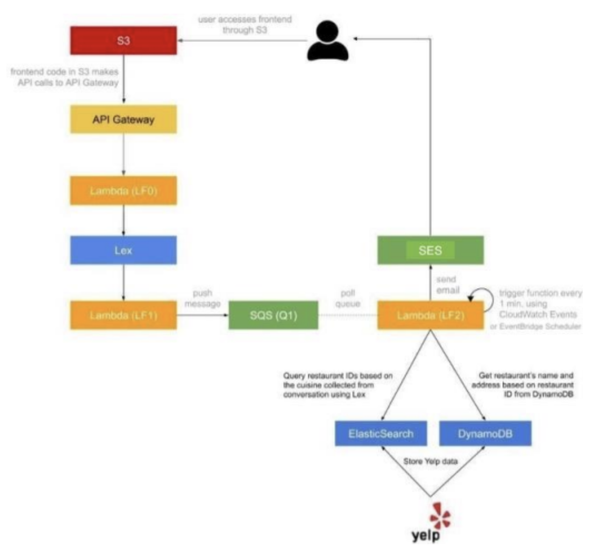

# Dining Concierge Chatbot

This repository contains a serverless web application for restaurant recommendations powered by **AWS services** and **Natural Language Processing**. The chatbot interacts with users to gather preferences and provides dining suggestions via email. The project is designed with scalability and modulularity in mind, using AWS Lambda, DynamoDB, Amazon OpenSearch, and other cloud tools.

## Features

- **Interactive Chatbot**: Users can chat to receive restaurant suggestions based on preferences like cuisine, location, time, and party size
- **Serverless Architecture**: Built using AWS Lambda, API Gateway, and Amazon Lex for a fully managed backend
- **Data Storage and Search**: Combines **DynamoDB** for structured storage and **OpenSearch** for quick retrieval of recommendations
- **Email Notifications**: Sends personalized restaurant suggestions to users via **Amazon SES**
- **Asynchronous Processing**: Utilizes **SQS** and event-driven Lambda functions for decoupled processing

## Getting Started

### Prerequisites

Ensure you have:

- An AWS account with permissions for S3, Lambda, DynamoDB, OpenSearch, SES, and SQS
- Node.js installed locally for running scripts like the Yelp scraper
- A valid Yelp API key for fetching restaurant data

## Setup

### 1. Frontend

- Navigate to the frontend directory and host the chatbot UI on **Amazon S3**
- Enable static website hosting as per the [AWS S3 Hosting Guide](https://docs.aws.amazon.com/AmazonS3/latest/userguide/WebsiteHosting.html)
- Update the API Gateway endpoint in `chat.js` to match your backend API URL

### 2. Backend

#### 2.1 API Gateway

- Import the provided Swagger file to set up API Gateway
- Enable CORS for all API methods

#### 2.2 Lambda Functions

- Deploy the following functions:
  - `lf0.js`: Handles API interactions with Lex
  - `lf1.js`: Processes intents from the Lex chatbot
  - `lf2.js`: Handles SQS messages and sends recommendations

#### 2.3 Amazon Lex

- Create a chatbot with the intents:
  - `GreetingIntent`, `ThankYouIntent`, and `DiningSuggestionsIntent`
  - Connect the Lex bot to `lf1.js` using Lambda code hooks

### 3. Data Pipeline

#### 3.1 Yelp Data

- Use `yelpScraper.js` to fetch restaurant data
- Store the data in **DynamoDB** with fields like `Business ID`, `Name`, `Address`, `Coordinates`, and `Rating`

#### 3.2 OpenSearch

- Use `opensearchIngest.js` to index restaurant data
- Index: `restaurants`
- Type: `Restaurant`

#### 3.3 SQS Queue

- Set up an SQS queue to collect user preferences for restaurant suggestions

#### 3.4 SES for Email

- Configure SES to send email notifications to users

#### 3.5 Automation

- Create a **CloudWatch event** or **EventBridge Scheduler** to trigger `lf2.js` every minute for processing queued requests

## Running the Application

1. Access the chatbot UI through the S3 URL
2. Interact with the chatbot to get restaurant recommendations
3. Check your email for suggestions

## Technologies Used

- **AWS Services**: S3, API Gateway, Lambda, Lex, DynamoDB, OpenSearch, SES, SQS
- **Yelp API**: For fetching restaurant data
- **Frontend**: Simple HTML, CSS, and JavaScript
